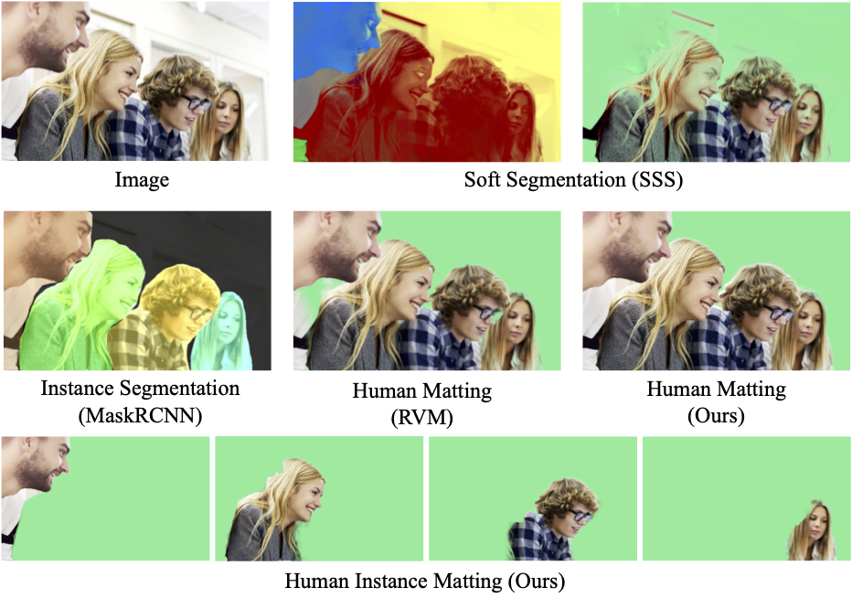

# InstMatt
Official repository for *Instance Human Matting via Mutual Guidance and Multi-Instance Refinement* (accepted by CVPR2022).



### Overview

This paper introduces a new matting task called instance human matting (IHM), which requires the pertinent model to automatically predict a precise alpha matte for each human instance.  Straightforward combination of  closely related techniques, namely, instance segmentation, soft segmentation and human/conventional matting, will easily fail in complex cases requiring disentangling mingled colors belonging to multiple instances along hairy and thin boundary structures.  To tackle these technical challenges, we propose an instance human matting framework, called InstMatt, where a novel mutual guidance strategy working in tandem with a multi-instance refinement module is used, for delineating multi-instance relationship among humans with complex and overlapping boundaries if present. A new IHM metric called instance matting quality (IMQ) is proposed, which addresses the absence of a unified and fair means of evaluation emphasizing  both instance recognition and matting quality. Finally, we construct an IHM benchmark for evaluation, which comprises of both synthetic and natural benchmark images. In addition to thorough experimental results on complex cases with multiple and overlapping human instances each has intricate boundaries, preliminary results are presented on general instance matting.

### Benchmark

To provide a general and comprehensive validation on instance matting techniques, we construct an instance matting benchmark,  **IHM2K**, which consists of a synthetic  subset and a natural subset totaling 2,000 images with high-quality matte ground truths. Download IHM2K [here](https://drive.google.com/file/d/1fjqfF-Zn6GoEsp0jPJqDbcGQsHm2YZ4w/view?usp=sharing). It is organized in the following. Each instance alpha matte is stored in a seperate image.

```
IHM2K/
    images/
        comp/
            xxx.jpg
            yyy.jpg
            ...
        natural/
            zzz.jpg
            ...
    alphas/
        comp/
            xxx/
                00.png
                01.png
                ...
            yyy/
            ...
        natural/
            zzz/
            ...

				
```

### Code

Code for training, evaluation and demo is coming soon.

### TODO List

- [x] Benchmark
- [ ] Training
- [ ] Evalution
- [ ] Demo

### Reference

If you find our work useful in your research, please consider citing:

```
@inproceedings{sun2022instmatt,
  author    = {Yanan Sun and Chi-Keung Tang and Yu-Wing Tai}
  title     = {Instance Human Matting via Mutual Guidance and Multi-Instance Refinement},
  booktitle = {Proceedings of the IEEE Conference on Computer Vision and Pattern Recognition},
  year      = {2022},
}
```

